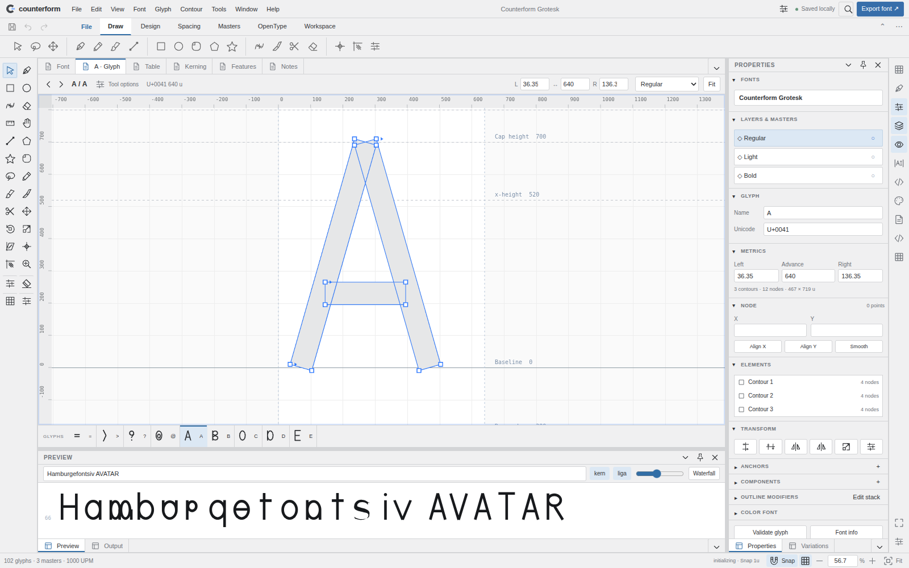

# Counterform Studio

### Make every curve count.

**A working, modular browser font editor built with HTML, JavaScript and SkiaSharpWeb, with an optional WebGPU compute package.** Version 0.7.0.

This is an original implementation targeting the FontLab 8.4 workflow. **It is not a feature-complete FontLab replacement.** The implemented subset includes real outline editing, masters, kerning, OpenType compilation, source interchange and live proofing—not simulated export buttons. Read [the capability contract](docs/CAPABILITIES.md) before editing production fonts. Unreconstructed font tables can be lost on re-export; keep originals.

[Open the live authoring studio](https://wieslawsoltes.github.io/CounterformStudio/) · [0.7.0 production workflows](docs/RELEASE-0.7.0.md)



[Workspace design, controls and appearance](docs/WORKSPACE-DESIGN.md). The compact ribbon, full Font window, collapsible palettes and paper-first canvas retain all existing editors. Window → Expanded ribbon restores labeled commands; Window → Workspace preferences controls appearance independently of source.

## Run offline from the source archive

Node.js 22 or newer:

```sh
cd CounterformStudio
npm run bootstrap
npm start
```

Open `http://127.0.0.1:4173`. The initial run does not require `npm install`, a CDN, an API key, cloud storage, or a downloaded font. The complete original demo font is generated from JavaScript outline data. Do not open `index.html` using `file://`.

The source archive includes pinned vendor runtime packages. Bootstrap creates local package links (junctions on Windows), a current HTML import map and a relative-URL compiler worker graph; it runs no dependency install scripts or network requests. `?demo` bypasses recent-project restoration.

## What works

The workspace uses real Dockyard docking, a RibbonWeb command ribbon, a virtual glyph library, a TreeDataGridWeb font inventory, a GridWeb kerning matrix and RichTextWeb notes. ReactiveWeb and DynamicDataWeb project the document state. Native Skia paths draw the font; RBushWeb accelerates node/handle picking, and QuikGraphWeb checks component dependency graphs.

Use nine command-backed menus, 151 commands, 24 pointer tools and a ribbon with 73 original SVG icons. Draw and edit Bézier contours, move handles, insert points, add rectangles/ellipses, measure, zoom and pan. Use snapping, 1/10/0.1-unit keyboard nudges, undo/redo, copy/paste, affine transforms, sidebearings, anchors, reusable components, overlap removal, Boolean operations and stroke expansion. Edit compatible masters and inspect read-only interpolated instances. Proof text uses a newly compiled `FontFace`, not a substitute preview typeface.

Export real **TTF, CFF/CFF2 OTF, WOFF1/WOFF2, variable TTF/CFF2, UFO3 archives and Counterform source**. Supported layout compilation includes single, multiple, alternate, ligature, chaining-context and reverse substitutions; single/pair/contextual positioning, named lookups and script/language selection; automatic and explicit mark-to-base, mark-to-ligature, mark-to-mark and cursive attachments, named anchors, mark filtering and GDEF classes. See the explicit [feature-language subset](docs/CONTEXTUAL-LAYOUT.md). Variable export writes `fvar`, `STAT`, optional `avar` 1.0 axis maps, TrueType `gvar` or CFF2 blend programs, `HVAR`, optional `MVAR`, and GDEF/GPOS variations for kerning and mark-to-base anchors. Browser WOFF2 uses stored Brotli blocks; the standalone Node subpath provides size compression. These exports remain unhinted. Color output supports COLRv0 fallback layers, all 18 static COLRv1 paint formats, all 28 compositing modes, and CPALv1 palette/entry labels and light/dark usability flags. OpenType → Color paint graph opens the transactional tree/property/proof editor for gradients, clipping, references and transforms. The compiled font renders in the browser proof and the native Skia source-master canvas; editable geometry remains separate. Variable outlines may carry static paints; PaintVar parameters, variable clip boxes, SVG and bitmap color tables are not supported.

Non-destructive outline stacks preserve editable contours through ordered affine transforms, rounding, winding reversal and repeats. Recovery journals retain integrity-checked revisions with atomic IndexedDB writes and cross-tab conflict protection. Imported originals can be downloaded byte-exactly; a separate metadata-only export preserves unrelated tables and refuses structural edits. These do not claim arbitrary lossless source reconstruction.

Axis mapping has a staged numerical/graph editor shared with the preview and variable compilers. The attachment editor validates actual compiled fonts, displays a FontFace proof and commits once with undo. Outline analysis reports analytic area/centroid/inflections, bounded arc length and a signed curvature comb without changing source. See [advanced authoring and headless APIs](docs/ADVANCED-AUTHORING.md).

## Repository structure

```text
app/                   Application bootstrap; native browser import map
packages/              31 independently packable @wieslawsoltes/counterform-* packages
vendor/                Pinned upstream source/runtime inputs
scripts/               Offline bootstrap, server, static build, npm packing, archiving
examples/              Headless font compiler example
tests/                 Node, browser, TypeScript and independent fontTools tests
docs/                  Architecture, APIs, keyboard map, capability and security contracts
test-results/          Reproducible reports and actual application screenshots
vendor-lock.json       Source provenance and artifact SHA-256 identifiers
```

## Verification

```sh
npm test
npm run test:types
npm run test:fonts
npm run test:browser
npm run test:workspace
npm run test:advanced
npm run test:workflows
npm run build
npm run pack:all
npm run test:packages
```

Python tests require `python -m pip install -r tests/requirements.txt`. Browser tests require Playwright Chromium (`python -m playwright install chromium`) or `CHROMIUM_PATH`. Type checking requires TypeScript (`tsc`). The app itself needs neither Python nor TypeScript.

The verification commands exercise Node, independent fontTools instancing/table checks, typed consumers, all packed npm packages, and source/distribution browser tests. Browser tests load eight color export variants through Chromium's font sanitizer; sample compiled gradients and native Skia pixels; exercise paint/stop/transform/composite editing and undo; edit/bypass/bake modifiers; edit master metrics; and (on secure origins) verify original preservation and recovery revisions. Exact pass counts are in the commit-associated CI artifacts.

Local opaque-origin browser tests report inline compilation and secure-API skips explicitly. Real workers, IndexedDB, and the deployed Pages subpath are tested in CI; software-rendered Chromium does not qualify physical WebGPU, Safari/Firefox, mobile hardware or assistive technology. See [release boundaries](docs/RELEASE-0.5.0.md).

## Modular npm packages

`npm run pack:all` emits 31 `.tgz` packages into `artifacts/npm`, each with source, declarations, license and declared dependencies. They are **packaged, not published to npm**. Root-workspace use is offline; installing a standalone package normally resolves its declared dependencies through your configured registry. Install the Counterform tarballs together while they are unpublished.

See [API examples](docs/API.md), [architecture](docs/ARCHITECTURE.md), [keyboard map](docs/KEYBOARD.md), and [production gaps](docs/CAPABILITIES.md).

## GitHub and static hosting

The source repository is `wieslawsoltes/CounterformStudio`. The recovered 0.2.0 release is committed at `586498b652a9c696188173e52dea91ccd366597e`; its tests and Pages deployment passed. The editable `app`, `packages`, `scripts` and `tests` directories are authoritative; archived recovery/delivery blobs are provenance only.

GitHub Actions runs core tests, independent font checks, typed and extracted package consumers, and separate source/distribution browser checks before deploying Pages. Pull requests test without deployment. The latest completed run and deployment are authoritative for publication status, not the existence of a version string or local archive.

The static build uses relative asset and worker URLs and supports a repository subpath. No compiler server or runtime CDN is required. Other hosts may apply `_headers`; GitHub Pages does not use that file. HTTP(S) is required. Do not copy a compiled font into the source tree or release artifacts.

## Licensing

MIT for Counterform's original code. Upstream licenses are retained, including QuikGraphWeb's MS-PL and the fontTools algorithm's BSD-style license. See [third-party notices](THIRD_PARTY_NOTICES.md). No font binaries are bundled in the deliverable.

## 0.7.0 production workflows

Use **Font → Metrics string editor**, **Font → Conditional OpenType features**, and **File → Font collection builder**. All three are also command-palette and ribbon actions. Collections opened through File → Open now present a face chooser. See [release notes](docs/RELEASE-0.7.0.md) and [typed API usage](docs/VARIABLE-FEATURES-COLLECTIONS-METRICS.md). This remains a qualified, incrementally developed application, not exhaustive FontLab parity.
