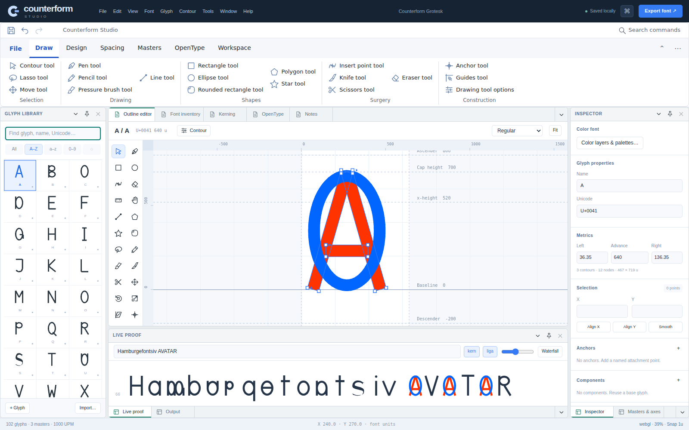

# Counterform Studio

### Make every curve count.

**A working, modular browser font editor built with HTML, JavaScript and SkiaSharpWeb, with an optional WebGPU compute package.** Version 0.2.0.

This is an original implementation targeting the FontLab 8.4 workflow. **It is not a feature-complete FontLab replacement.** The implemented subset includes real outline editing, masters, kerning, OpenType compilation, source interchange and live proofing—not simulated export buttons. Read [the capability contract](docs/CAPABILITIES.md) before editing production fonts. Unreconstructed font tables can be lost on re-export; keep originals.



## Run offline from the source archive

Node.js 22 or newer:

```sh
cd CounterformStudio
npm run bootstrap
npm start
```

Open `http://127.0.0.1:4173`. The initial run does not require `npm install`, a CDN, an API key, cloud storage, or a downloaded font. The complete original demo font is generated from JavaScript outline data. Do not open `index.html` using `file://`.

The source archive includes pinned vendor runtime packages. Bootstrap creates local package links (junctions on Windows), a current HTML import map and a relative-URL compiler worker graph; it runs no dependency install scripts or network requests. `?demo` bypasses recent-project restoration.

## What works

The workspace uses real Dockyard docking, a RibbonWeb command ribbon, a virtual glyph library, a TreeDataGridWeb font inventory, a GridWeb kerning matrix and RichTextWeb notes. ReactiveWeb and DynamicDataWeb project the document state. Native Skia paths draw the font; RBushWeb accelerates node/handle picking, and QuikGraphWeb checks component dependency graphs.

Draw and edit Bézier contours, move handles, insert points, add rectangles/ellipses, measure, zoom and pan. Use snapping, 1/10/0.1-unit keyboard nudges, undo/redo, copy/paste, affine transforms, sidebearings, anchors, reusable components, overlap removal, Boolean operations and stroke expansion. Edit compatible masters and inspect read-only interpolated instances. Proof text uses a newly compiled `FontFace`, not a substitute preview typeface.

Export real **TTF, CFF OTF, WOFF1, variable TTF, UFO3 archives and Counterform source**. Supported layout compilation includes single substitutions, ligatures, pair kerning, mark-to-base attachment and GDEF classes. Variable export writes `fvar`, `gvar` and `STAT`; it does not emit variable kerning, CFF2 or hinting. COLRv0/CPALv0 output supports ordered monochrome glyph layers, multiple RGBA palettes and foreground color. Advanced COLRv1 paint graphs are not implemented. OpenType → Color layers & palettes (or the Inspector button) opens transactional color authoring.

## Repository structure

```text
app/                   Application bootstrap; native browser import map
packages/              20 independently packable @wieslawsoltes/counterform-* packages
vendor/                Pinned upstream source/runtime inputs
scripts/               Offline bootstrap, server, static build, npm packing, archiving
examples/              Headless font compiler example
tests/                 Node, browser, TypeScript and independent fontTools tests
docs/                  Architecture, APIs, keyboard map, capability and security contracts
test-results/          Reproducible reports and actual application screenshots
vendor-lock.json       Source provenance and artifact SHA-256 identifiers
```

## Verification

```sh
npm test
npm run test:types
npm run test:fonts
npm run test:browser
npm run build
npm run pack:all
```

Python tests require `python -m pip install -r tests/requirements.txt`. Browser tests require Playwright Chromium (`python -m playwright install chromium`) or `CHROMIUM_PATH`. Type checking requires TypeScript (`tsc`). The app itself needs neither Python nor TypeScript.

Recorded local qualification: **60 Node tests**, **11 independent fontTools checks**, **27 passing browser checks plus one IndexedDB skip on each of source and static distribution**, **20 fresh extracted npm packages**, and TypeScript consumer compilation. Node tests execute actual compiler workers and the generated browser dependency graph in a clean worker host without npm/import maps. Color tests check compiled font pixels, RGBA byte order, variable instances and source import. Autosave tests cover in-flight writes, trailing edits, rejection and reentrant callbacks.

The local browser run uses Chromium's native-Skia **canvas/raster backend** and **explicit inline compilation** in an opaque local-content context. It does **not qualify browser Worker startup over HTTPS, physical WebGPU, IndexedDB, Safari/Firefox or mobile devices**. Normal CI requires the real worker backend and IndexedDB save/load. See [0.2.0 qualification](docs/RELEASE-0.2.0.md) for the exact boundary.

## Modular npm packages

`npm run pack:all` emits 20 `.tgz` packages into `artifacts/npm`, each with source, declarations, license and declared dependencies. They are **packaged, not published to npm**. Root-workspace use is offline; installing a standalone package normally resolves its declared dependencies through your configured registry. Install the Counterform tarballs together while they are unpublished.

See [API examples](docs/API.md), [architecture](docs/ARCHITECTURE.md), [keyboard map](docs/KEYBOARD.md), and [production gaps](docs/CAPABILITIES.md).

## GitHub and static hosting

The source repository is `wieslawsoltes/CounterformStudio`. The initial v0.1.0 delivery was committed and its Pages deployment succeeded. The last verified remote `main` is `ff279154a3156797e6352ce6f4b28699284ee3e4`; this v0.2.0 delivery is an apply-ready local patch, not a claimed new remote deployment.

Apply the supplied patch from a clean clone, then push without force:

```sh
git checkout main
git pull --ff-only
git am /path/to/CounterformStudio-0.2.0.patch
git push origin main
```

The included GitHub Actions workflow runs core tests, independent font checks, typed and extracted package consumers, and separate source/distribution browser checks before deploying Pages. Pull requests test without deployment. This updated workflow has not been executed remotely for the local patch.

The static build uses relative asset and worker URLs and supports a repository subpath. No compiler server or runtime CDN is required. Other hosts may apply `_headers`; GitHub Pages does not use that file. HTTP(S) is required. Do not copy a compiled font into the source tree or release artifacts.

## Licensing

MIT for Counterform's original code. Upstream licenses are retained, including QuikGraphWeb's MS-PL and the fontTools algorithm's BSD-style license. See [third-party notices](THIRD_PARTY_NOTICES.md). No font binaries are bundled in the deliverable.
