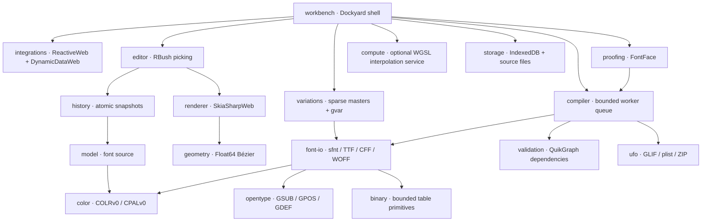

# Architecture

## Separation of concerns

Counterform uses editable source data as its authority. Rendered paths, compiled fonts, virtual grid rows and proof faces are disposable projections. There is no binary-font object masquerading as a source document.

The compute package is independently callable. The interactive source interpolation path currently uses deterministic CPU doubles; GPU interpolation is not automatically substituted into font compilation. The workbench exposes a diagnostic that initializes and verifies the compute backend. The Skia surface requests its own automatic backend selection independently.

## Coordinate and source contract

The model is JSON-serializable: font metadata, masters and axis locations; glyph identities and Unicode scalars; source layers; contours and endpoint nodes; absolute incoming/outgoing cubic handles; component affine transforms; anchors; guides; groups and per-master kerning; feature source; notes and preserved metadata; ordered color-layer glyph IDs and equal-length RGBA palettes. Color layers reference monochrome outlines, not recursively rendered color glyphs.

Font coordinates are y-up and double precision. A contour edge uses its first node's outgoing handle and second node's incoming handle, falling back to endpoints when absent. The renderer applies y inversion exactly once. Camera offsets are CSS pixels; device pixel ratio is applied only at surface composition. The demo's uppercase O has editable cubic contours rather than an SVG thumbnail acting as the editing model.

Compiled TTF outlines are adaptively converted to quadratic points. Static CFF uses Type 2 cubic charstrings. Variable conversion makes subdivision decisions across **all masters together**, preserving point correspondence before writing full-point gvar deltas and phantom points. A change in topology is rejected, not matched heuristically.

## Components actually consumed

| Existing project | Runtime use |
|---|---|
| Dockyard | Document/anchorable panes, splitter resizing, tool panes, distinct layout undo |
| TreeDataGridWeb | Font inventory; editable advance width and export flag |
| DynamicDataWeb | Keyed glyph projection and change subscriptions |
| RibbonWeb | Ribbon tabs, command buttons, backstage, accessibility and keyboard behavior |
| SkiaSharpWeb | Native SKPath/SKCanvas/SKPaint surface, Boolean paths, strokes, CFF outline import |
| ReactiveWeb | ReactiveObject view state: current glyph/master/filter/status |
| RBushWeb | Spatial indexing of nodes and control handles |
| QuikGraphWeb | Component graph construction and topological/cycle validation |
| GridWeb | Editable numeric kerning matrix and frozen labels |
| RichTextWeb | Editable rich project notes and serialized FlowDocument source |

No SkiaSharpWeb API was changed. Public `SK*` calls are consumed behind a Counterform adapter; new font-authoring APIs live in Counterform packages rather than being added incompatibly to SkiaSharp. Upstream compatibility is not expanded merely by using the library.

## History and event ownership

Document history is separate from Dockyard's layout history. Source mutations are grouped into glyph- or whole-font snapshots with limits of 150 transactions and an approximate 48 MiB journal budget. Pointer drags begin once and commit on pointer-up; cancellation restores the before image. Shape validation occurs before committing the source. Listener failures are reported without aborting delivery to the remaining source observers.

Window-capture command dispatch prevents docking's own undo handler from consuming document undo, while editable inputs retain their own local editing keys. Commands have context, enablement, repeat policy and user-remappable bindings. Browser-reserved combinations are a platform limitation, not silently claimed as exact native parity.

The workbench owns subscriptions, resize observers, input AbortControllers, native paths, surfaces, fonts and compute devices. `dispose()` tears down that ownership tree. Rich-text edits have their own debounce before entering document history; layout operations never enter font history.

## Render/update strategy and present limits

The virtual glyph library materializes visible rows. Canvas refreshes are frame-coalesced; paths are cached until geometry changes. Pointer motion changes only the current glyph transaction. Source projection uses DynamicData keys; proof compilation is debounced and a generation number rejects stale FontFace completions.

Compilation, table inspection and full-document validation run through a shared worker queue by default. The compiler receives immutable snapshots, not live document references. Full snapshot cloning still occurs on the caller thread. Large CJK fonts, million-point contours, variable-font throughput, native memory soak and peak GPU memory are **not qualified**. The optional GPU compute service is separate from the CPU compiler worker. Storage is local IndexedDB plus explicit file downloads; no OPFS write-ahead journal, collaboration backend or crash-replay log exists yet.

## Worker graph and cancellation

`compiler` owns one lazily created worker and a bounded priority queue. FIFO sequence breaks equal-priority ties. A request key supersedes older work with the same key. Cancelling active synchronous compilation terminates the worker rather than setting an ineffective flag inside blocked JavaScript. Queued work restarts on a new worker. Timeouts include worker startup/execution, not queue residence. Signals, timers and event listeners are released on every settlement path. Disposal rejects outstanding promises. Progress reports compiler stages, not invented per-glyph completion.

FontProof shares the workspace compiler but owns its request key and FontFace lifecycle. Its generation increments as soon as an edit is scheduled, so a face from an already-obsolete source is never installed. Binary buffers transfer back; font source remains in the browser and no network compiler service is used. Inline mode is explicit and cannot preempt synchronous work.

Because HTML import maps are not worker import maps, `scripts/worker-build.mjs` parses the pinned static dependency graph using Node's VM parser, mirrors its modules, rewrites static specifiers to relative URLs and rejects unresolved dependencies. Bootstrap/build generate `app/workers/compiler.js` plus a 31-module graph and hash manifest. Runtime packages retain their normal npm imports; only this generated application deployment graph is rewritten. No SkiaSharpWeb API changes are needed. The script is a linker for this static graph, not a general JavaScript bundler.

## Color table ownership

`color` depends only on bounded binary primitives. The model uses it for source validation; font-io supplies the exact final glyph order at compilation. COLRv0 base records are sorted by glyph ID; ordered layer records carry mapped glyph IDs and palette indexes. CPAL stores BGRA while source strings use CSS RGBA. The foreground sentinel remains 65535. Self references are allowed because layer glyphs use their monochrome outlines. References to excluded/deleted glyphs are rejected. The decoder bounds expanded palettes/layers as well as raw byte ranges, rejecting disproportionate shared-record expansion.

The editor's native Skia path projection draws every color layer back-to-front and keeps the base contour editable. Conversion to SkiaSharp's ARGB hexadecimal parsing stays inside the renderer adapter. Browser proof text is separately rendered from the compiled COLR/CPAL font, and tests examine actual pixel colors. Preview currently uses palette zero; palette-selection UI and CPALv1 metadata remain future work.

## Save completion and shutdown

ProjectStore captures and validates its snapshot before awaiting database open. Concurrent open calls share a promise; closing during open invalidates and closes a late result. Autosave exposes one shared flush promise that drains the active snapshot and any trailing edits. Intermediate snapshots are not announced as saved. Errors return false and can be retried. Disposal suppresses new/trailing work and callbacks while allowing an already-started write to settle. This is not a crash write-ahead log or a full durability guarantee.

## Authoring extensions (0.3.0)

The standalone `construction` package depends only on `geometry`; it has no renderer or DOM dependency. `icons` owns original SVG paths and packaged assets. `menus` accepts a registry interface and optional icon/shortcut formatting factories; its DOM lifetime is explicitly disposed. The editor's `interactions.js` implements bounded pointer state machines and source history transactions. Workbench `authoring-ui.js` composes tool options, guide editing, ribbon definitions and menu definitions; there is one command registry, not separate menu/ribbon business logic. Counterform now has 23 npm package boundaries.
