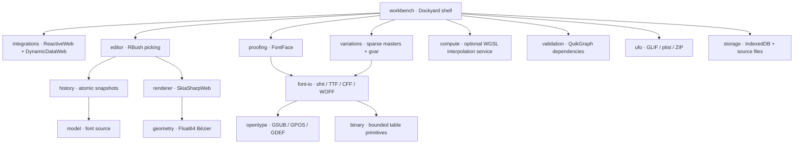

# Architecture

## Separation of concerns

Counterform uses editable source data as its authority. Rendered paths, compiled fonts, virtual grid rows and proof faces are disposable projections. There is no binary-font object masquerading as a source document.

The compute package is independently callable. The interactive source interpolation path currently uses deterministic CPU doubles; GPU interpolation is not automatically substituted into font compilation. The workbench exposes a diagnostic that initializes and verifies the compute backend. The Skia surface requests its own automatic backend selection independently.

## Coordinate and source contract

The model is JSON-serializable: font metadata, masters and axis locations; glyph identities and Unicode scalars; source layers; contours and endpoint nodes; absolute incoming/outgoing cubic handles; component affine transforms; anchors; guides; groups and per-master kerning; feature source; notes and preserved metadata.

Font coordinates are y-up and double precision. A contour edge uses its first node's outgoing handle and second node's incoming handle, falling back to endpoints when absent. The renderer applies y inversion exactly once. Camera offsets are CSS pixels; device pixel ratio is applied only at surface composition. The demo's uppercase O has editable cubic contours rather than an SVG thumbnail acting as the editing model.

Compiled TTF outlines are adaptively converted to quadratic points. Static CFF uses Type 2 cubic charstrings. Variable conversion makes subdivision decisions across **all masters together**, preserving point correspondence before writing full-point gvar deltas and phantom points. A change in topology is rejected, not matched heuristically.

## Components actually consumed

| Existing project | Runtime use |
|---|---|
| Dockyard | Document/anchorable panes, splitter resizing, tool panes, distinct layout undo |
| TreeDataGridWeb | Font inventory; editable advance width and export flag |
| DynamicDataWeb | Keyed glyph projection and change subscriptions |
| RibbonWeb | Ribbon tabs, command buttons, backstage, accessibility and keyboard behavior |
| SkiaSharpWeb | Native SKPath/SKCanvas/SKPaint surface, Boolean paths, strokes, CFF outline import |
| ReactiveWeb | ReactiveObject view state: current glyph/master/filter/status |
| RBushWeb | Spatial indexing of nodes and control handles |
| QuikGraphWeb | Component graph construction and topological/cycle validation |
| GridWeb | Editable numeric kerning matrix and frozen labels |
| RichTextWeb | Editable rich project notes and serialized FlowDocument source |

No SkiaSharpWeb API was changed. Public `SK*` calls are consumed behind a Counterform adapter; new font-authoring APIs live in Counterform packages rather than being added incompatibly to SkiaSharp. Upstream compatibility is not expanded merely by using the library.

## History and event ownership

Document history is separate from Dockyard's layout history. Source mutations are grouped into glyph- or whole-font snapshots with limits of 150 transactions and an approximate 48 MiB journal budget. Pointer drags begin once and commit on pointer-up; cancellation restores the before image. Shape validation occurs before committing the source. Listener failures are reported without aborting delivery to the remaining source observers.

Window-capture command dispatch prevents docking's own undo handler from consuming document undo, while editable inputs retain their own local editing keys. Commands have context, enablement, repeat policy and user-remappable bindings. Browser-reserved combinations are a platform limitation, not silently claimed as exact native parity.

The workbench owns subscriptions, resize observers, input AbortControllers, native paths, surfaces, fonts and compute devices. `dispose()` tears down that ownership tree. Rich-text edits have their own debounce before entering document history; layout operations never enter font history.

## Render/update strategy and present limits

The virtual glyph library materializes visible rows. Canvas refreshes are frame-coalesced; paths are cached until geometry changes. Pointer motion changes only the current glyph transaction. Source projection uses DynamicData keys; proof compilation is debounced and a generation number rejects stale FontFace completions.

Compilation and full-document validation still run synchronously on the browser thread. Large CJK fonts, million-point contours, variable-font throughput, native memory soak and peak GPU memory are **not qualified**. The next performance milestone is a worker compiler and immutable revision snapshots; the current compute service is not a substitute for that work. Storage is local IndexedDB plus explicit file downloads; no OPFS write-ahead journal, collaboration backend or crash-replay log exists yet.
