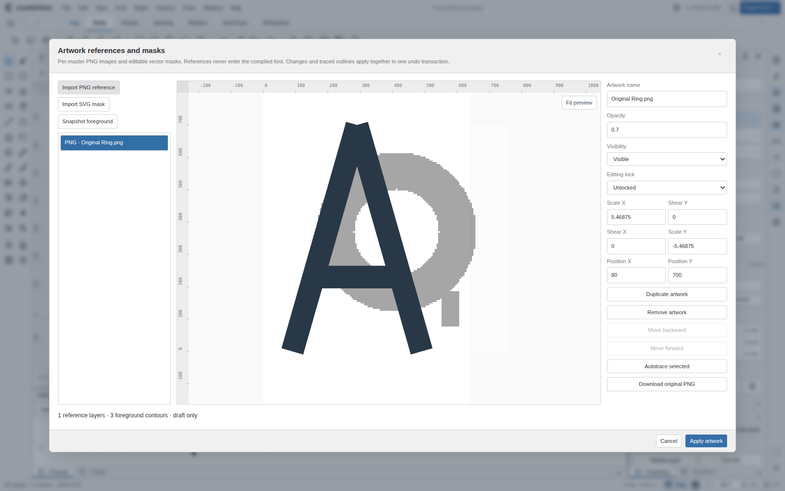
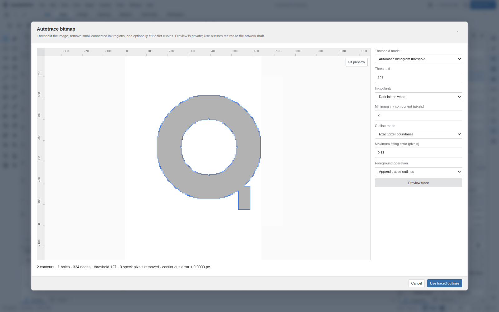

# Artwork and tracing delivery — 0.9.0

The complete readable implementation, tests, package metadata and documentation were committed at `a850ab7db08c669e48a8404b26820235ec0ed236`. All ten pinned vendors remain unchanged. The release has 34 standalone npm packages, 156 command-backed actions, 24 pointer tools and 76 original vector icons. This is an implemented parity increment, not completion of FontLab parity.

Source-delivery run `35510204846` verified the source archive SHA-256 and every input/output Git blob before restoring 83 files. It passed all 234 core tests and the 10 artwork/tracing browser workflows with actual browser workers, then committed the readable source and two fresh native-rendering screenshots. The temporary source-materialization workflow is now retired. Editable source directories are authoritative; the immutable files under `.delivery` retain provenance and must not overwrite subsequent development.

The permanent CI gate now runs the artwork suite on source and built distribution alongside all existing editor, workspace, input/lifetime, attachment/mapping/analysis, conditional-layout/collection/metrics and Unicode/SVG suites. TypeScript, independent font comparisons and all extracted npm consumers remain required. The subsequent deploy and live-pages jobs establish publication of the exact HTTPS commit; their recorded run status, not this document, confirms final deployment.

Local verification also passed all 234 core tests, strict TypeScript consumers, 86 independent font/layout scenarios and 34 extracted npm consumers. The new source and distribution artwork suites passed 10/10 locally with no page exceptions. Local HTTP navigation is restricted, so isolated tests explicitly use inline compilation and native Skia raster rendering. Local original-editor/workspace suites retain explicit secure-storage skips. Actual browser-worker and secure-origin validation is performed separately in GitHub Actions. Software-rendered CI does not qualify physical WebGPU, Safari/Firefox, touch hardware, assistive technology, or exhaustive native FontLab gestures.

References are source-only per-master PNG images and vector masks; they do not become font ink until outlines are explicitly inserted, exchanged or traced. The exact tracing mode preserves thresholded pixel-cell geometry and counters. Optional cubic fitting bounds continuous distance in input coordinates using double-precision control-hull calculations; it does not certify optical quality or preserve topology at arbitrarily close boundaries. Neither feature is an implementation of bitmap/SVG color-font tables or proprietary FontLab construction algorithms.

See [release notes](RELEASE-0.9.0.md), [workflow and algorithm contracts](ARTWORK-TRACING.md) and [the capability ledger](CAPABILITIES.md). Package archives are generated and tested, not automatically published to npm.

