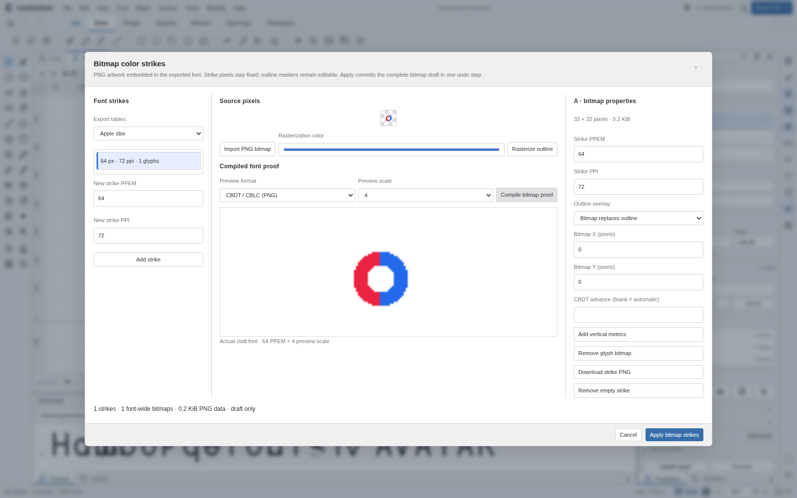

# Bitmap color-font delivery — 0.10.0

The complete editable bitmap implementation and a fresh Chromium screenshot were committed directly to `main` at `59bafd5af28a2fefb0e74de2544a70c3bc107a0e`. All ten pinned vendor libraries and SkiaSharpWeb APIs remain unchanged. The release has 35 standalone packages, 157 command-backed actions, 24 pointer tools and 76 original SVG icons. This is a verified parity increment, not full FontLab parity.

Source-delivery run `35534850307` verified the SHA-256 archive and all 66 input/output source records, passed 259 core tests and 16 independent bitmap fontTools scenarios, exercised the bitmap workflows with real browser workers, and committed the readable implementation. The one-shot bitmap importer is retired; editable source is authoritative.

The normal verification workflow retains all font, package, typing, native-readiness and browser assertions. Eight browser suites now run as independent jobs, each on source and the exact shared built distribution: bitmap, artwork, Unicode/SVG interchange, conditional layout/collections/metrics, attachments/axis maps/analysis, workspace input/lifetimes, original editor and desktop workspace. Jobs have isolated servers and browser profiles; failure in any suite prevents Pages deployment. Matrix fail-fast is disabled so other suites retain their diagnostic evidence. Source workers are rebuilt from the same checkout; distribution workers come from the single runtime artifact, not a second build.

`counterform-verification` contains the source archive, independent-font reports and all npm archives; `counterform-browser-*` artifacts contain each source/distribution browser report and screenshots. The deployment and live-pages jobs must succeed to establish publication of the exact commit. This document does not predeclare their outcome. The final HTTPS gate checks the asset manifest commit, actual worker startup, icons, menus, storage and disposal.

Local source/distribution bitmap checks passed 8/8 using explicit inline compilation and native Skia raster. Remote software-rendered Chromium exercises actual workers and secure storage; neither is physical WebGPU, Safari/Firefox or assistive-technology certification. Bitmap import reconstructs supported PNG tables and retains default outlines, including the private outline-only Skia extraction path; it is not universal lossless source reconstruction.

See [release notes](RELEASE-0.10.0.md), [bitmap source and API contracts](BITMAP-COLOR-FONTS.md) and [capability ledger](CAPABILITIES.md). PNG square horizontal bitmap strikes are delivered; bitmap interpolation, pixel-brush authoring, non-PNG/vertical-only strikes, variable COLRv1, SVG fonts, hinting/debugging and broader native parity remain distinct work. Packed npm archives are tested, not automatically published to the registry.

