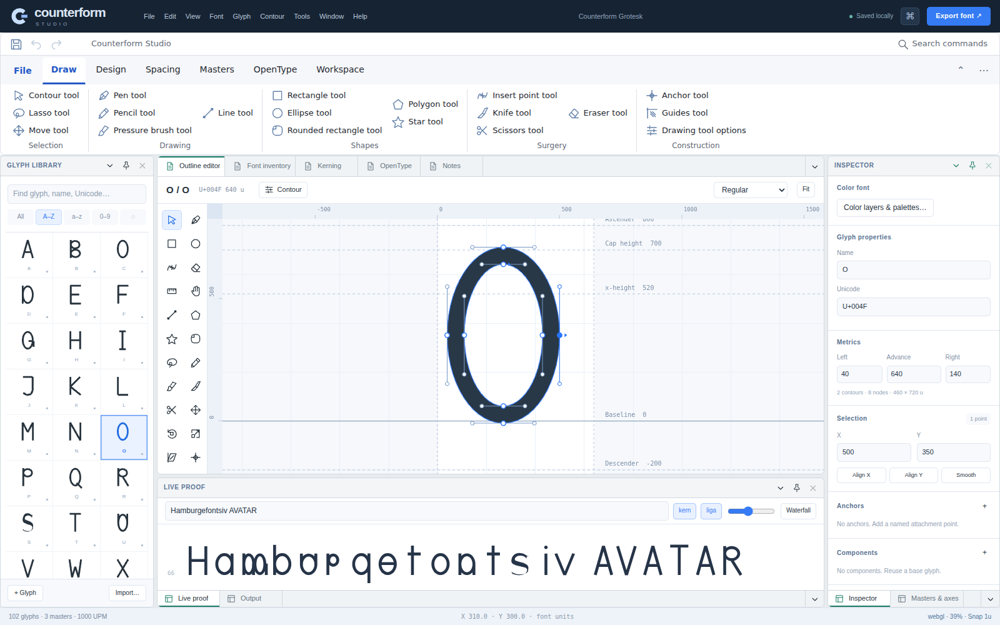
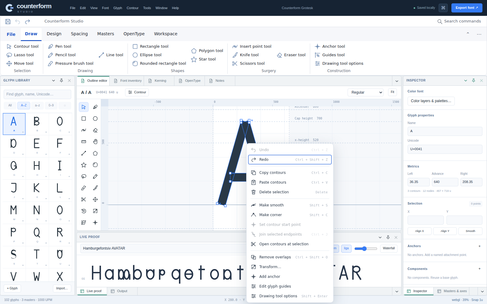
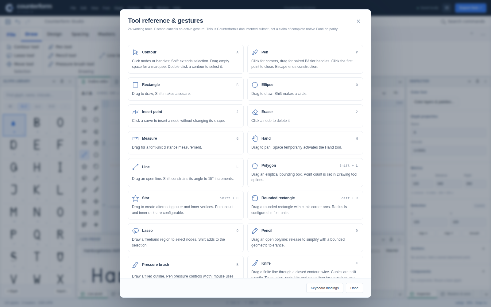

# Committed and published delivery

## 0.3.0 authoring tools

The editable application and all 23 npm packages were committed at `05eaaebd4648a1757627c2eb1323761d3c75a599`. Verified application screenshots were committed at `13456fc22c7783f0228e548ca08317c76d454729`.

GitHub Actions run `35217343506` completed core, fontTools, TypeScript, package-consumer, source-browser and distribution-browser verification, then successfully deployed GitHub Pages. The source contains 24 pointer tools, nine command-backed menus, 130 commands and 67 original SVG icons. See `RELEASE-0.3.0.md` for exact behavior and limitations; this is not full FontLab parity.

## Recovered prior delivery

The intact 0.2.0 source was restored at `586498b652a9c696188173e52dea91ccd366597e`. Its verification and deployment completed in run `35213392194`. The interrupted later upload fragments were preserved for provenance; no claim is made that their corrupted data was reconstructed.

## Ongoing verification

The one-shot delivery workflow has been retired to prevent archived patches from overwriting future source. The editable `app`, `packages`, `scripts`, and `tests` directories are authoritative. Ordinary pushes run all verification gates before Pages deployment; pull requests test without deploying.

A post-deployment HTTPS browser test additionally requires the exact commit in `asset-manifest.json`, loads the application under `/CounterformStudio/`, verifies actual worker compilation, visible ribbon icon assets, keyboard menus, IndexedDB roundtrip in an ephemeral demo profile, and clean disposal. Its result is recorded separately in the `counterform-live-pages` artifact. Physical WebGPU hardware, native FontLab behavior, Safari/Firefox and assistive-technology certification remain separate acceptance gates.

## Actual application screenshots

