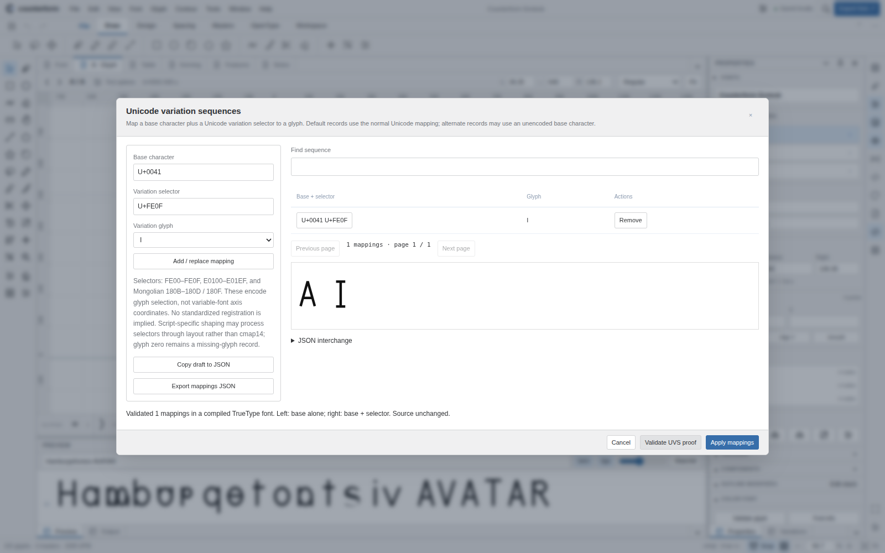
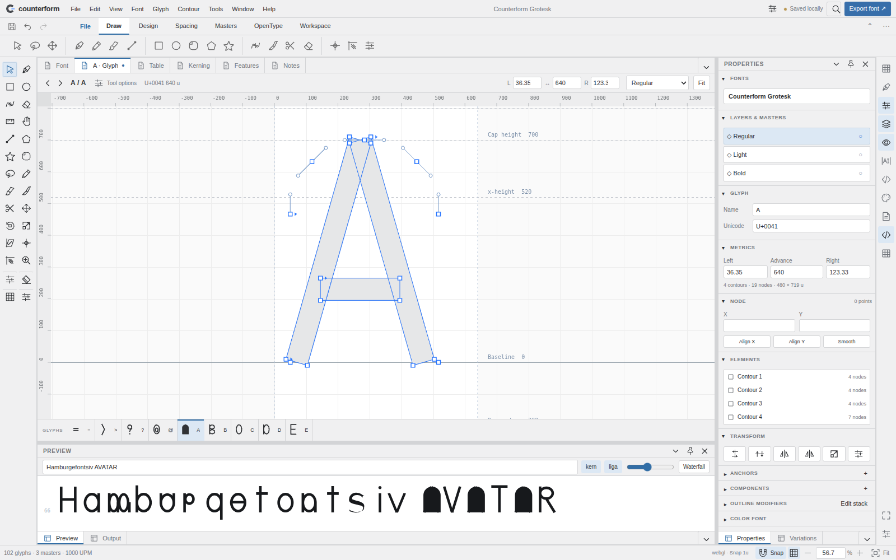

# Unicode and SVG interchange delivery — 0.8.0

The complete readable implementation, tests, package metadata and documentation were committed at `18706caae85d6892dd767dec836f25356b961740`. All ten pinned vendors remain unchanged. The release has 32 standalone npm packages, 152 command-backed actions, 24 pointer tools and 73 vector icons. This is a parity increment, not completion of FontLab parity.

Source-delivery run `35506827000` verified the SHA-256 archive and every input/output Git blob before restoring 95 source files, passed all 212 core tests and the 11 new browser workflows with actual compiler workers, and committed two fresh application screenshots. The temporary materialization workflow has now been retired. The normal CI workflow runs source and distribution Unicode/SVG/modal checks alongside the existing original-editor, desktop-workspace, input/lifetime, attachment/mapping/analysis and conditional-layout/collection/metrics suites before deploying Pages. Its subsequent live-pages job requires the exact deployed commit; delivery is confirmed by that job's recorded result, not assumed by this document.

Local verification also passed strict TypeScript consumers, all eight independent font/layout suites (86 scenarios total), 32 extracted npm consumers, and source/distribution browser suites. Isolated local browsing uses inline compilation and Skia raster rendering and skips secure-origin storage tests. Actual worker/storage verification is performed separately on GitHub. Neither local nor software-rendered CI checks certify physical GPU performance, native FontLab pixel/shortcut parity, every script or accessibility hardware.

The prior baseline's queued native-close lifecycle regression is corrected with synchronous, exactly-once owned-resource cleanup. The original assertions are retained; close events remain native, returnValue is preserved, and canceled Escape remains canceled.

See [release notes](RELEASE-0.8.0.md), [source and API contracts](UNICODE-SVG-INTERCHANGE.md) and [the capability ledger](CAPABILITIES.md). Archive transport under `.delivery` is historical provenance; editable source directories remain authoritative. Packed packages are verified but not automatically published to npm.

