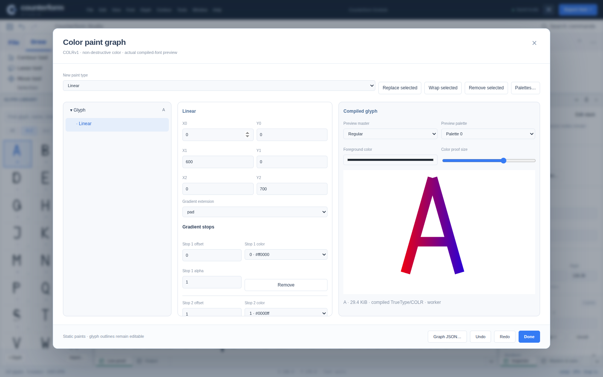
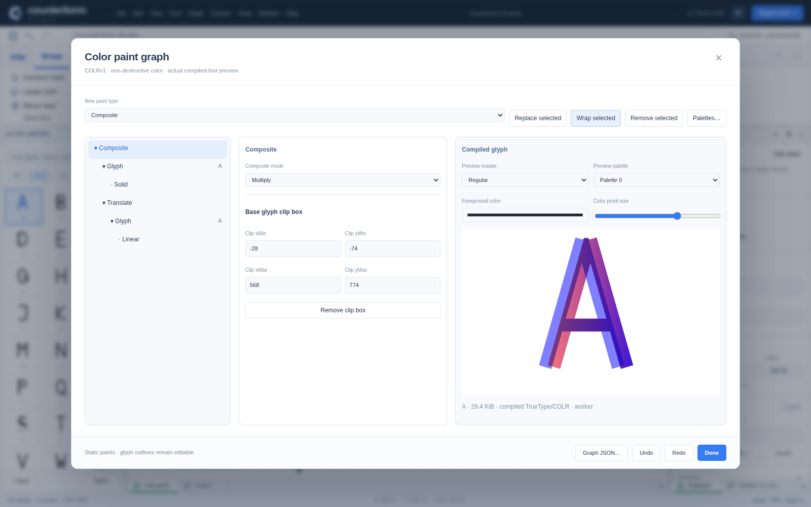
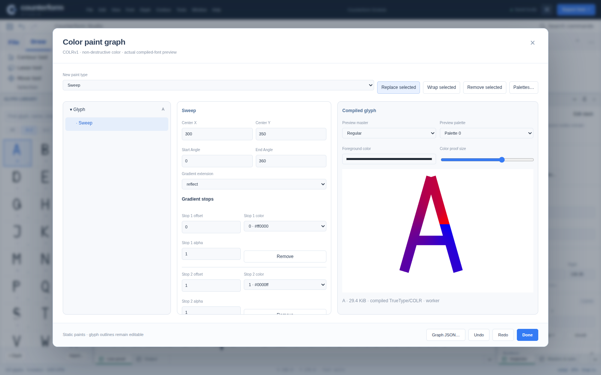

# Counterform Studio 0.5.0 — static color paint authoring

Date: 2026-09-17. The complete editable 0.5.0 source is committed on `main` at `12b9c3aca24d59154d79676ef8b3d6ae96f1f7ed`. See [delivery status](DELIVERY-STATUS.md) for remote verification and publication. The local measurements below remain the original delivery evidence, not a substitute for CI results.

## Implemented

Thirty standalone npm packages now include `counterform-colrv1`. The codec implements all 18 non-variable COLRv1 paint formats: layers, solid, three gradients, glyph clipping, referenced color glyphs, affine/translate/scale/rotate/skew transforms and their centered/uniform variants, and compositing with all 28 modes. CPALv1 adds palette names, entry names and light/dark usability flags. COLRv0 fallback records remain available alongside v1 graphs. Palette names are allocated after variation names without collisions.

The Color paint graph command opens a three-column editor: keyboard-navigable paint tree, type-specific properties and compiled-font proof. It includes layer ordering/duplication/removal, wrapper insertion, linear/radial/sweep presets, stop addition/sorting/removal, extend modes, alpha/foreground selection, glyph references, all transform fields, composite modes, clip boxes and validated JSON replacement/export. Palette editing updates metadata arrays transactionally. Source geometry is retained. Invalid/cyclic source rolls back with visible errors rather than corrupting undo history.

The dialog renders actual compiled bytes through FontFace. The main source-master canvas renders current color fonts through the unmodified SkiaSharpWeb SKTypeface/SKFont/SKCanvas APIs, preserving source-node overlays. Its native cache is guarded by document, revision and master, and replaced/disposed deterministically. Pending or stale bytes cannot paint a newer document. The dialog cancels its compiler key, removes its face and unsubscribes on close. The new original SVG icon raises the icon set to 68 and the shared command registry to 137.

## Import and export

Static paints compile into TTF, CFF OTF, CFF2 OTF, variable TTF/CFF2 and WOFF/WOFF2. Variable outlines and metrics do not imply variable paint parameters. The native source-master canvas is distinct from the read-only interpolated outline canvas; compiled variable-font proof/export remains available. Supported TrueType COLR/CPAL imports reconstruct static paint graphs and names. CFF/WOFF import still reconstructs default outlines through Skia, not arbitrary original color/layout source. Semantic color reconstruction is not byte-identical table preservation; untouched and metadata-only originals use the separate guarded archive path.

## Reliability fixes

Glyph-scoped history now validates references against the whole source document while retaining scoped snapshots. Duplicating a color glyph remaps self-outline references in both fallback layers and paint trees. Numeric range controls set limits before values so the browser cannot silently clamp the initial size. Nested dialog close cannot cause the workbench disposal loop to skip another owned resource.

## Verification

The completed local run passed **127 core tests** (zero failures/skips), strict TypeScript consumer compilation, **40 independent font/layout checks** (11 general, 9 exports, 14 contextual/HarfBuzz, 6 COLRv1), and **30 freshly extracted npm packages**, including a real Node compiler worker. Source and built distribution each passed **57 browser checks** with zero page exceptions and **three explicit secure-origin skips**. The skipped cases cover archived-original export, recovery-journal storage, and IndexedDB roundtrip; they are not counted as passes. See [the evidence manifest](verification/0.5.0/manifest.json) and adjacent reports/logs.

Run `npm test`, `npm run test:types`, `npm run test:fonts`, `npm run build`, `npm run pack:all`, `npm run test:packages`, then the browser suite on source and distribution. Exact local results are recorded in the accompanying release verification manifest and reports; no success is inferred from compilation alone.

The independent color oracle builds expected tables with fontTools colorLib and compares decoded paint graphs, static clips, palette names and variable-name allocation across six binary variants. Browser checks sample real FontFace and native Skia color pixels, edit paint/stop/transform/composite/JSON controls and undo, load eight color export variants into Chromium's sanitizer, and verify close/reopen/disposal. The local browser uses isolated assets, explicit inline compilation and native Skia raster because localhost navigation is blocked. Secure-origin persistence/recovery checks are explicitly skipped. Real packaged Node workers are tested. A previous successful remote CI run does not qualify these new changes on HTTPS or hardware.

## Boundaries

This is not full FontLab parity. PaintVar formats, variable paint stores and clips, SVG/bitmap color tables, hint authoring/debugger, full FEA grammar/attachments, specialized native drawing and metric workflows, proprietary source adapters and exhaustive native shortcuts remain incomplete or absent. The codec's explicit 65,535-node/stop, 64-depth and 16-MiB defaults intentionally reject extreme expansion; they are not a claim to reconstruct every valid arbitrary COLRv1 file. Hardware WebGPU, Safari/Firefox, long-session stress and full assistive-technology qualification remain separate gates.

Primary specification references consulted for this implementation:

- https://learn.microsoft.com/en-us/typography/opentype/spec/colr
- https://learn.microsoft.com/en-us/typography/opentype/spec/cpal
- https://learn.microsoft.com/en-us/typography/opentype/spec/name

No installed font files are included or redistributed. Procedural test fonts are confined to temporary verification directories. npm archives are packed and integrity-checked, not published to a registry.

## Actual application

