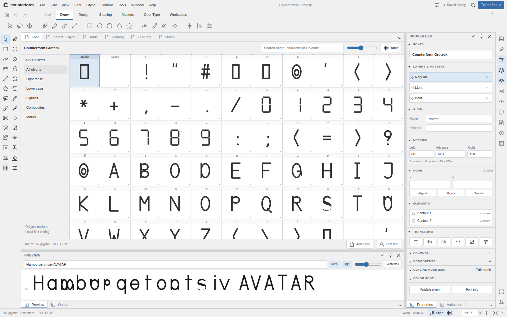
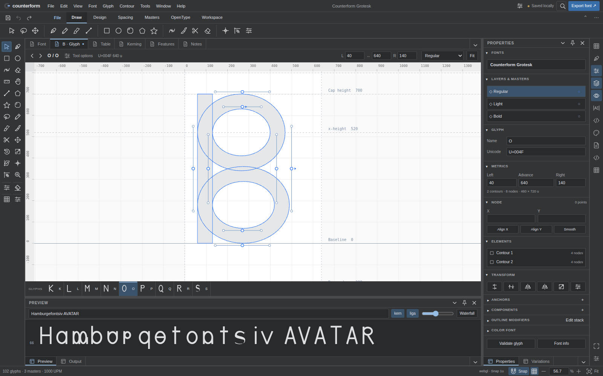

# Desktop type-design workspace — 0.5.1

## Reference and design decisions

The visual reference is FontLab 8's documented workspace, not its proprietary code, artwork, or icon assets. Its compact menus, horizontal property bar, left tool box, full Font window, white glyph canvas, right panel list and collapsible palettes provide the organizing model. Reference: [FontLab 8: Explore & prepare](https://help.fontlab.com/fontlab/8/whats-new/whats-new-01-explore-prepare/), consulted 2026-09-17.

Counterform keeps its own identity and command contracts. The design is a native-style reinterpretation, **not a pixel-identical or behavior-complete FontLab implementation**.

The interface now uses neutral gray chrome, square docking edges, a 32-pixel menu bar, restrained separators, small original vector icons and compact numeric fields. The previous oversized identity header and card-like pane decoration no longer compete with the drawing. Editing uses a subdued outline fill; clean Preview renders actual ink. Color-font artwork continues to render from compiled bytes rather than being tinted by the outline preference.

## Workspace anatomy

The two-column tool box stays available beside every document. A compact, icon-only RibbonWeb command row is the default; **Window → Expanded ribbon** restores the full labeled ribbon. Both modes retain six tabs, quick-access Save/Undo/Redo, backstage actions, overflow controls and the same command objects.

The center contains **Font, Glyph, Table, Kerning, Features and Notes** documents. Glyph tabs include the current glyph name and modification state. The Glyph property bar provides previous/next navigation, tool options, Unicode/width information, direct left/advance/right metrics, master selection and Fit. Metric inputs route through the same validated transaction boundary as the original inspector. Invalid or blank entries roll back; locked and interpolated source stays read-only.

An adjacent-glyph strip uses the actual editable outlines, not a substituted display font. Clicking a glyph returns focus to the canvas. Arrow keys and Home/End move keyboard focus through this strip; Enter and Space activate a button.

The right **Properties** palette stack retains the existing field/list objects and their listeners: Fonts, Layers & Masters, Glyph, Metrics, Node, Elements, Transform, Anchors, Components, Outline modifiers and Color font. Section headers collapse via pointer, Enter or Space. Elements selects real contour nodes; its list supports arrows and Home/End. Escape from an inspector field returns to the canvas. Secondary color and modifier functions remain in their original editors and menus.

A narrow **Panels list** exposes the existing editor and panel commands. Dockyard continues to own docking, resizing, tab overflow, floating, auto-hide, visibility, layout undo and redo. **Focus workspace** temporarily hides auxiliary panes and restores its saved arrangement when toggled again. **Reset workspace layout** reconstructs the initial layout through Dockyard's content registry without remounting the editors or altering source history.

The lower Preview remains the existing compiled FontFace proof with text, feature switches, size and waterfall controls. The status bar exposes snapping, grid, numerical zoom (2.5–6400%), zoom buttons and Fit alongside source and renderer information. Wheel/pinch/camera gestures are unchanged.

## Font window

The full-size Font document complements, rather than removes, the TreeDataGrid inventory. It shares the existing ReactiveWeb/DynamicData selection, query and category projection. Categories, name/character/Unicode search, adjustable 56–144-pixel cells, Add glyph, Font Info and Table navigation are functional. The optional **Glyph navigator** restores the left thumbnail sidebar.

The virtual grid has one stable focus owner, ARIA row/column metadata and an active descendant. Arrow keys, Home/End and PageUp/PageDown scroll the actual selected item into view. Enter or a double-click opens the selected glyph; fitting waits for the document layout to become visible. Filtering and browsing never create a font-source undo record.

## Appearance and preferences

**Window → Workspace preferences** configures Light/Dark/Follow system, white paper versus theme-matched canvas, compact/expanded ribbon and editing-fill shading. Appearance is stored in the existing ProjectStore, under `counterform.workspace.v1`. Values are normalized; grid size is bounded; malformed or unknown fields are discarded. Palette collapse state and navigator visibility are also device-local. Writes are serialized from immutable snapshots. Source files, compiled fonts, document undo and recovery journals do not contain these preferences.

CSS is layered inside the existing workbench package: `styles.css` imports preserved base control styles from `legacy.css`, followed by `workspace.css`. A lifecycle-owned stylesheet adapts RibbonWeb's Shadow DOM without replacing its model, commands or rendering code. The constructable sheet survives internal rerenders; a disposable mutation observer provides the fallback. All stylesheet files remain npm side effects.

## Library and package continuity

No vendor file, vendor lock entry or SkiaSharp-compatible API was changed. Dockyard, TreeDataGridWeb, DynamicDataWeb, RibbonWeb, SkiaSharpWeb, ReactiveWeb, RBushWeb, QuikGraphWeb, GridWeb and RichTextWeb retain their existing roles. No substitute UI framework or external icon/font dependency was added. The release retains all 30 standalone packages, with five additional original icons (73 total), 145 registered commands and the existing 24 pointer tools.

The headless preference normalizer is also available as `@wieslawsoltes/counterform-workbench/preferences`. `StudioWorkbench.workspaceUI` provides typed appearance/layout control, and `setGlyphMetric` is the shared editor transaction boundary. `GlyphRenderer.dimFill` defaults to false for standalone renderer consumers; only the workbench opts into subdued editing fill.

## Verification and boundaries

`tests/workspace-preferences.test.mjs` checks defaults, value bounds, immutable normalization, inherited/foreign fields, theme resolution and icon mapping. `tests/workspace-browser.py` adds 15 desktop UX gates, including real pane commands, focus, actual glyph selection, invalid metric rollback, undo, repeated layout restoration, preference persistence, 1600/1280/1024/768-pixel layouts and complete disposal. Original 60-check browser regression suites and all engine/typed/package checks remain in CI. Screenshot artifacts are generated from the actual application.

Opaque-origin local tests explicitly skip secure storage and use inline compilation. CI uses real browser workers and IndexedDB; post-deployment checks require the exact commit under `/CounterformStudio/`. SwiftShader is software-rendering qualification, not a physical WebGPU benchmark. Safari/Firefox, native screen-reader certification, native menu integration and exhaustive FontLab shortcut parity remain unqualified. This presentation release makes no new font-format or hinting parity claim.
